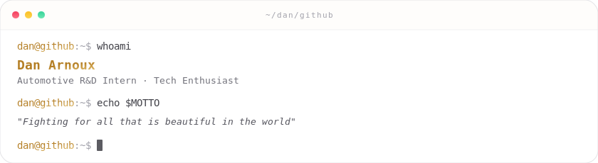

<picture>
  <source media="(prefers-color-scheme: dark)" srcset="./assets/header-dark.svg">
  
</picture>

  

&nbsp;
&nbsp;
&nbsp;

  

<i>I value practical engineering, clear reasoning, and systems that can be explained and reproduced. 
I build tools I use every day, and write about the decisions behind them.</i>

<a href="https://danarnoux.com/about/">Learn more about me →</a>

---

## Featured Projects

<table>
<tr>
<td width="50%" valign="top">

### [DansBlog](https://github.com/Dancncn/DansBlog)

Static blog built with **Astro + Tailwind**, deployed on Cloudflare. Features AI comment moderation, GitHub OAuth, and full-stack Workers backend (D1, R2, KV).

</td>
<td width="50%" valign="top">

### [babel-window-translator](https://github.com/Dancncn/babel-window-translator)

Frameless, always-on-top desktop translation sidebar for Windows. Built with **Tauri + Vue + Rust**, supports OCR screen capture and any OpenAI-compatible API.

</td>
</tr>
<tr>
<td width="50%" valign="top">

### [Lumera](https://github.com/Dancncn/Lumera)

Multiplayer online card game with bluffing/challenge mechanics. Pure **TypeScript** engine with single authoritative state machine, WebSocket multiplayer, and anti-cheat by design.

</td>
<td width="50%" valign="top">

### [Demiurge](https://github.com/Dancncn/Demiurge)

Lightweight, open-source desktop companion Agent engine built with **Rust + Tauri + React**. Local-first framework for streaming chat, tool use, memory, sub-agents, and JSON DSL workflow orchestration.

</td>
</tr>
</table>

---

## Tech Stack

---

## GitHub Stats

