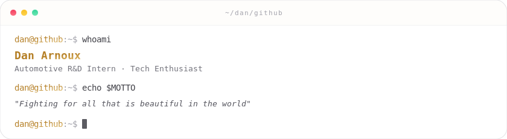

<picture>
  <source media="(prefers-color-scheme: dark)" srcset="./assets/terminal-dark.svg">
  
</picture>

  

&nbsp;

---

## Featured Projects

<table>
<tr>
<td width="50%" valign="top">

### [DansBlog](https://github.com/Dancncn/DansBlog)

Static blog built with **Astro + Tailwind**, deployed on Cloudflare. Features AI comment moderation, GitHub OAuth, and full-stack Workers backend (D1, R2, KV).

</td>
<td width="50%" valign="top">

### [babel-window-translator](https://github.com/Dancncn/babel-window-translator)

Frameless, always-on-top desktop translation sidebar for Windows. Built with **Tauri + Vue + Rust**, supports OCR screen capture and any OpenAI-compatible API.

</td>
</tr>
<tr>
<td width="50%" valign="top">

### [Lumera](https://github.com/Dancncn/Lumera)

Multiplayer online card game with bluffing/challenge mechanics. Pure **TypeScript** engine with single authoritative state machine, WebSocket multiplayer, and anti-cheat by design.

</td>
<td width="50%" valign="top">

### [AI-Session-Transfer](https://github.com/Dancncn/AI-Session-Transfer)

Lightweight tool to sync and migrate local chat sessions for **Codex & Claude Code** across different AI providers and middle-stations.

</td>
</tr>
</table>

---

## Tech Stack

---

## GitHub Stats

<picture>
  <source media="(prefers-color-scheme: dark)" srcset="https://github-readme-stats.vercel.app/api?username=Dancncn&show_icons=true&hide_rank=true&title_color=e2be6e&icon_color=e2be6e&text_color=a1a1aa&bg_color=0f0f11&border_color=27272a&border_radius=12">
  
</picture>
&nbsp;
<picture>
  <source media="(prefers-color-scheme: dark)" srcset="https://github-readme-stats.vercel.app/api/top-langs/?username=Dancncn&layout=compact&hide=c%2B%2B,c&title_color=e2be6e&text_color=a1a1aa&bg_color=0f0f11&border_color=27272a&border_radius=12">
  
</picture>

